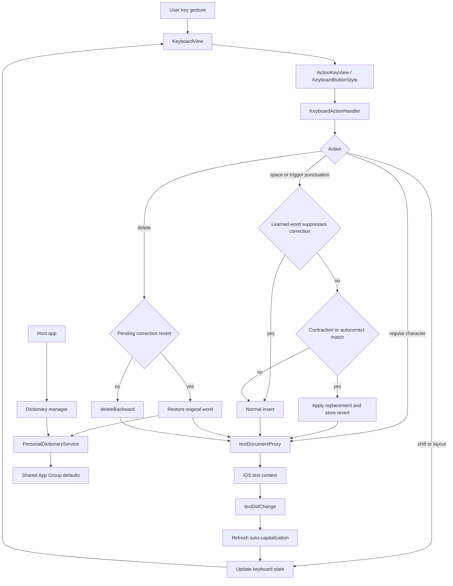

# MyCuKey

Custom iOS keyboard extension built with SwiftUI + UIKit.

## Vision

MyCuKey is built around one guiding goal: make this keyboard feel as fluent, reliable, and natural as possible. Apple-level feel is the benchmark. The project is not just about adding features; it is about shaping every interaction so typing feels fast, stable, predictable, and effortless in daily use.

## Setup

1. Open `MyCuKey.xcodeproj` in Xcode.
2. Ensure both targets have the **App Group** capability with `group.com.kvolodymyr.MyCuKey`.
3. Add your Apple account in Xcode Signing if needed.
4. Build and run the **MyCuKey** app scheme.
5. On device/simulator: **Settings → General → Keyboard → Keyboards → Add New Keyboard → MyCuKey**
6. Toggle **Allow Full Access** on the keyboard entry.
7. Switch to MyCuKey via the globe key in any text field.

## Features

- **QWERTY / Numeric / Symbolic** layout switching
- **Auto-capitalization** — sentence-aware, synchronous prediction bypassing iOS IPC lag
- **Caps Lock** — double-tap shift within 0.35s to lock
- **Correction triggers** — correction pass runs on `space`, `.`, `,`, `!`, `?`, `*`, and newline
- **Double-space → period** — fast double space inserts `. ` and triggers capitalization
- **Spacebar trackpad** — drag to move cursor with 3-zone acceleration (precise / medium / fast)
- **Accelerated delete** — character-by-character for first ~1s, then word-by-word
- **Long-press comma → ?** popup
- **Return key** — inserts newline
- **Haptics** — light on key press, soft on autocorrection apply, rigid on correction revert, medium on word delete and long-press popup activation, silent on empty field
- **Personal dictionary memory**
  - Learned words suppress future contraction/autocorrection passes for matching normalized token
  - Reverting the same correction twice promotes the original word (promotion threshold = `2`)
  - Manual dictionary manager in the app (add/search/delete/clear)
- **Revert on delete** — immediate backspace after correction restores original typed word + trigger suffix
- **Dark/Light mode** — follows system appearance

## Personal Dictionary Rules

The personal dictionary is not meant to replace a strong autocorrection engine. Its job is to protect typing trust: names, slang, intentional spellings, and custom words should stop being "fixed" once the user has clearly shown that the keyboard was wrong.

- Storage: shared App Group `UserDefaults` suite `group.com.kvolodymyr.MyCuKey`
- Cross-process sync: reads refresh from shared storage so app-side edits are visible to keyboard behavior without rebuilding
- Learned word normalization: lowercase
- Learnable token constraints:
  - length `2...40`
  - must contain at least one letter
  - allows letters, digits, apostrophe `'`, hyphen `-`
  - rejects whitespace-only, punctuation-only, or invalid-symbol tokens
- Promotion behavior:
  - each correction revert increments a counter for the original normalized word
  - at count `2`, the word is added to learned words and the counter is cleared
- Manual dictionary actions clear pending revert count for affected words

## Request Flow

Simplified overview of the main keyboard request/response loop.

## Requirements

- iOS 26.0+
- Recent Xcode version with iOS 26 SDK support
- Swift 5
