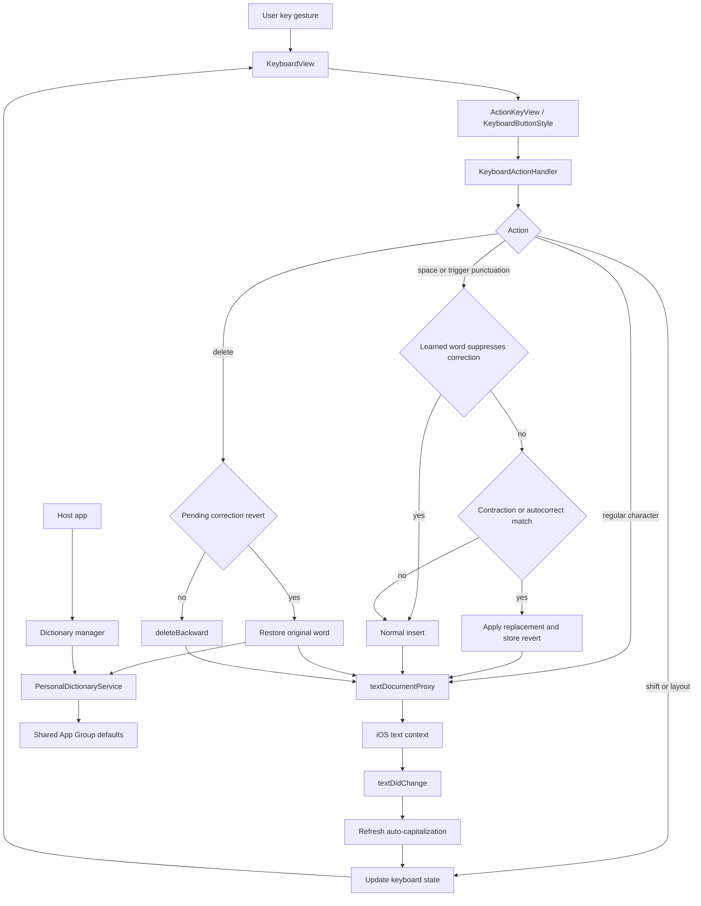

# MyCuKey

MyCuKey is a custom iOS keyboard extension built with SwiftUI and UIKit.

## Overview

The project focuses on practical keyboard reliability: predictable typing, conservative correction, fast interaction feedback, and a clear separation between what the keyboard can confidently fix on its own and what it should surface as a suggestion instead.

Current reliability priorities and known platform ceilings are tracked in [docs/ReliabilityRoadmap.md](docs/ReliabilityRoadmap.md).

## Scope

- **Typing language today:** English-first keyboard behavior
- **App localization:** English and German
- **Keyboard layout today:** one keyboard layout system shared across alphabetic, numeric, and symbolic modes

MyCuKey currently treats English as the main typing language for autocorrection, suggestions, and dictionary heuristics. German support currently applies to the companion app UI, not to a separate German keyboard layout or German correction engine.

## Setup

1. Open `MyCuKey.xcodeproj` in Xcode.
2. Ensure both targets have the **App Group** capability with `group.com.kvolodymyr.MyCuKey`.
3. Add your Apple account in Xcode Signing if needed.
4. Build and run the **MyCuKey** app scheme.
5. On device or simulator: **Settings → General → Keyboard → Keyboards → Add New Keyboard → MyCuKey**
6. Toggle **Allow Full Access** on the keyboard entry.
7. Switch to MyCuKey via the globe key in any text field.

## Features

- **QWERTY / Numeric / Symbolic** layout switching
- **Auto-capitalization** — sentence-aware capitalization with local context handling
- **Autocorrection** — conservative, trust-first correction with deterministic typo fixes, immediate revert on delete, and support for wrapped plain-word fixes such as `*teh* → *the*`
- **Suggestion bar** — ranked current-word suggestions with the original token on the left, the strongest repair in the center, and a secondary alternative on the right
- **Caps Lock** — double-tap shift within 0.35s to lock
- **Correction triggers** — correction pass runs on `space`, `.`, `,`, `!`, `?`, `*`, and newline
- **Double-space → period** — fast double-space inserts `. ` and triggers capitalization
- **Spacebar trackpad** — drag to move cursor with 3-zone acceleration (precise / medium / fast)
- **Accelerated delete** — character-by-character for first ~1s, then word-by-word
- **Key popups** — character preview popups with long-press alternates such as `, → ?` and `* → "`
- **Return key** — inserts newline
- **Haptics** — light on key press, soft on autocorrection apply, rigid on correction revert, medium on word delete and long-press popup activation, silent on empty field
- **Personal dictionary memory**
  - Learned words suppress future contraction and autocorrection passes for matching normalized token
  - Reverting the same correction twice promotes the original word (promotion threshold = `2`)
  - Manual dictionary management in the app (add, search, delete, clear)
- **Revert on delete** — immediate backspace after correction restores original typed word + trigger suffix
- **Dark/Light mode** — follows system appearance

## Architecture

MyCuKey follows the standard hybrid custom-keyboard structure used by many serious iOS keyboard projects:

- **Keyboard extension** — real-time typing UI, key handling, correction, suggestion, and cursor behavior
- **Companion app** — setup flow, learned-word management, and app-side UI
- **Shared App Group storage** — shared learned-word state and settings between app and extension

This keeps latency-sensitive behavior local to the extension while still allowing the main app to manage longer-lived state.

## Platform Ceilings

These are limits of the public iOS custom-keyboard API surface, not just local bugs in MyCuKey:

- **Host presentation artifacts** — a brief flash or jump can still happen when the keyboard appears or switches. MyCuKey can avoid adding extra instability, but it does not fully control the system keyboard host.
- **Background coverage ceiling** — the keyboard does not own every visible region around it. In practice, a background image or visual treatment can fill MyCuKey’s content area, but not the full system-managed space around the custom keyboard.
- **Cursor/navigation ceiling** — reliable character-by-character movement is possible, but advanced multiline cursor behavior depends on limited `UITextDocumentProxy` context, especially after the insertion point. Vertical movement and selection behavior are therefore less dependable than Apple’s own keyboard.
- **Document-model ceiling** — custom keyboards do not get a rich editable text model, robust selection mutation APIs, or Apple’s private autocorrection stack. Some “Apple-grade” behavior is simply outside the public extension surface.
- **Testing ceiling** — true end-to-end XCTest automation for the keyboard extension is unreliable because Simulator/XCTest does not consistently present the software keyboard for custom-keyboard flows. Regression confidence therefore relies more on unit tests and manual smoke checks than on full UI automation.
- **Tooling ceiling** — external CLI or MCP-driven build/test flows can disagree with the active Xcode session because signing, provisioning, and simulator state are not always resolved the same way outside Xcode itself. In practice, the open Xcode session is sometimes the source of truth.

## Current Priorities

The main near-term focus areas are:

- improving visible suggestion quality without making silent autocorrection too aggressive
- keeping personal dictionary learning predictable and conservative
- tightening interaction polish around popup behavior, delete/revert flow, and keyboard mode transitions
- expanding regression coverage around the most trust-sensitive typing paths

## Personal Dictionary Rules

The personal dictionary is meant to protect typing trust: names, slang, intentional spellings, and custom words should stop being "fixed" once the user has clearly shown that the keyboard was wrong.

- Storage: shared App Group `UserDefaults` suite `group.com.kvolodymyr.MyCuKey`
- Sync: app and extension both refresh from shared storage
- Normalization: lowercase
- Token rules: length `2...40`, at least one letter, letters/digits/apostrophe/hyphen allowed
- Promotion: the same reverted correction must happen twice before the original word is learned
- Manual dictionary changes also clear any pending revert count for that word

## Request Flow

Simplified view of the main keyboard loop.

## Requirements

- iOS 26.0+
- Recent Xcode version with iOS 26 SDK support
- Swift 5
