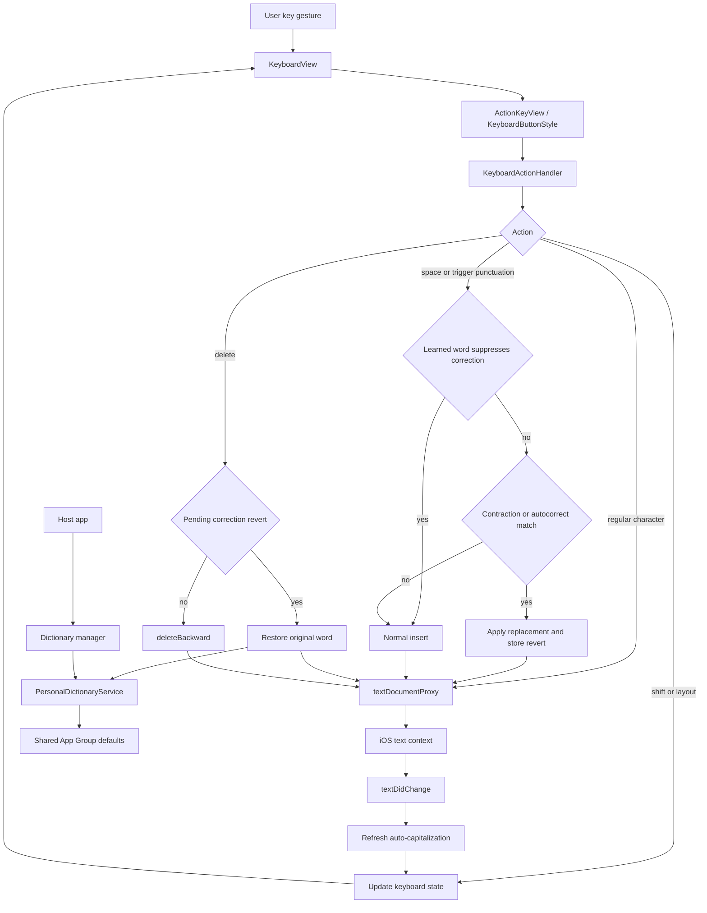

# MyCuKey

MyCuKey is a custom iOS keyboard extension built with SwiftUI and UIKit.

## Overview

The project focuses on practical keyboard reliability: predictable typing, conservative correction, fast interaction feedback, and a clear separation between what the keyboard can confidently fix on its own and what it should surface as a suggestion instead.

Current reliability priorities and known platform ceilings are tracked in [docs/ReliabilityRoadmap.md](docs/ReliabilityRoadmap.md).

## Scope

- **Typing language today:** English-first keyboard behavior
- **App localization:** English and German
- **Keyboard layout today:** one keyboard layout system shared across alphabetic, numeric, and symbolic modes

MyCuKey currently treats English as the main typing language for autocorrection, suggestions, and dictionary heuristics. German support currently applies to the companion app UI, not to a separate German keyboard layout or German correction engine.

## Setup

1. Open `MyCuKey.xcodeproj` in Xcode.
2. Ensure both targets have the **App Group** capability with `group.com.kvolodymyr.MyCuKey`.
3. Add your Apple account in Xcode Signing if needed.
4. Build and run the **MyCuKey** app scheme.
5. On device or simulator: **Settings → General → Keyboard → Keyboards → Add New Keyboard → MyCuKey**
6. Toggle **Allow Full Access** on the keyboard entry.
7. Switch to MyCuKey via the globe key in any text field.

For deterministic command-line builds and tests, run `scripts/xc.sh test` (see header comment in the script for options).

## Features

- **QWERTY / Numeric / Symbolic** layout switching
- **Auto-capitalization** — sentence-aware capitalization with local context handling
- **Autocorrection** — conservative, trust-first correction with deterministic typo fixes, immediate revert on delete, and support for wrapped plain-word fixes such as `*teh* → *the*`
- **Unified decoder** — a `WordTrie` over the 50k-word frequency lexicon answers prefix completion and bounded Damerau-Levenshtein repair from one structure, giving uniform suggestion coverage at every token length (no length cliff); protect-in-vocab stops valid words being changed
- **Spatial decoder** (in progress) — per-tap `(x,y)` capture plus a Gaussian key model feed a beam search that decodes sloppy taps into the intended word; live path wired, pending on-device tuning
- **Suggestion bar** — ranked current-word suggestions with the original token on the left, the strongest repair in the center, and a secondary alternative on the right
- **Caps Lock** — double-tap shift within 0.35s to lock
- **Correction triggers** — correction pass runs on `space`, `.`, `,`, `!`, `?`, `*`, and newline
- **Double-space → period** — fast double-space inserts `. ` and triggers capitalization
- **Spacebar trackpad** — drag to move cursor with 3-zone acceleration (precise / medium / fast)
- **Accelerated delete** — character-by-character for first ~1s, then word-by-word
- **Key popups** — character preview popups with long-press alternates such as `, → ?` and `* → "`
- **Return key** — inserts newline
- **Haptics** — light on key press, soft on autocorrection apply, rigid on correction revert, medium on word delete and long-press popup activation, silent on empty field
- **Personal dictionary memory**
  - Learned words suppress future contraction and autocorrection passes for matching normalized token
  - Reverting the same correction twice promotes the original word (promotion threshold = `2`)
  - Manual dictionary management in the app (add, search, delete, clear)
- **Revert on delete** — immediate backspace after correction restores original typed word + trigger suffix
- **Dark/Light mode** — follows system appearance

## Architecture

MyCuKey follows the standard hybrid custom-keyboard structure used by many serious iOS keyboard projects:

- **Keyboard extension** — real-time typing UI, key handling, correction, suggestion, and cursor behavior
- **Companion app** — setup flow, learned-word management, and app-side UI
- **Shared App Group storage** — shared learned-word state and settings between app and extension

This keeps latency-sensitive behavior local to the extension while still allowing the main app to manage longer-lived state.

The keyboard extension is grouped by responsibility: `Input/` (key handling and the suggestion-bar flow), `Decoding/` (`WordTrie`, the unified noisy-channel `UnifiedDecoder`, and the `SpatialDecoder` tap decoder), `Autocorrection/` (the engine plus its ranking and gating pipeline), `Suggestions/` (candidate providers and the trie-backed `SuggestionCandidateIndex`), `Lexicon/` (frequency and personal-dictionary sources), and `Views/`, `Styles/`, `Utilities/`, `Resources/` for the UI layer.

## Typing Engine Roadmap

The bar is Apple-grade "type sloppily, get the right words" on English. Against a heavy fat-finger sentence, native silently repairs almost everything while MyCuKey leaves most words wrong. The gap is three capabilities, in priority order:

1. **Decoder-driven auto-apply** — let the trie noisy-channel decoder silently commit a fix, not just suggest it. *Shipped (safe slice):* it commits only when the winning repair is unambiguous (alone at its edit distance) and the token is neither a real word (even one missing from the lexicon, via `UITextChecker`) nor an intentional spelling (stray doubled letter, expressive repeat). This closes clear cases like `peoole → people` and `dobe → done` with zero over-correction; ambiguous cases are deliberately deferred to #2.
2. **Bigram / context language model** — *Shipped:* `BigramModel` scores candidates by the previous word, so an edit-distance tie is broken by context (`fifty fivd → five`) and short tokens the unigram regime is too cautious to touch are rescued when the previous word is decisive (`spent ny → my`). When no candidate is predicted by the previous word it still defers. v1 ships an in-code curated collocation seed, swappable for a corpus table without touching call sites. To reach common inflections our 50k list omits (`spent`, `things`), the context path also folds in `UITextChecker`'s guesses — the full system dictionary — for free, ranked by the same frequency + bigram model; system-only words commit only when context backs them, so precision is unchanged (`i slent → spent`).
3. **Word split / merge** — retokenize across spaces for `firme → for me` and `ibt he → in the`. Hardest, smallest payoff, done last.

## Platform Ceilings

These are limits of the public iOS custom-keyboard API surface, not just local bugs in MyCuKey:

- **Host presentation artifacts** — a brief flash or jump can still happen when the keyboard appears or switches. MyCuKey can avoid adding extra instability, but it does not fully control the system keyboard host.
- **Background coverage ceiling** — the keyboard does not own every visible region around it. In practice, a background image or visual treatment can fill MyCuKey’s content area, but not the full system-managed space around the custom keyboard.
- **Cursor/navigation ceiling** — reliable character-by-character movement is possible, but advanced multiline cursor behavior depends on limited `UITextDocumentProxy` context, especially after the insertion point. Vertical movement and selection behavior are therefore less dependable than Apple’s own keyboard.
- **Document-model ceiling** — custom keyboards do not get a rich editable text model, robust selection mutation APIs, or Apple’s private autocorrection stack. Some “Apple-grade” behavior is simply outside the public extension surface.

## Testing

Three layers, all runnable headless via `scripts/xc.sh`:

- **Unit** (`test`) — correction, dictionary, and capitalization logic
- **Snapshot** (`test`) — in-process SwiftUI view rendering pinned against committed references
- **End-to-end** (`uitest`) — XCUITest typing on the **live** keyboard extension and asserting autocorrection fires

## Personal Dictionary Rules

The personal dictionary is meant to protect typing trust: names, slang, intentional spellings, and custom words should stop being "fixed" once the user has clearly shown that the keyboard was wrong.

- Storage: shared App Group `UserDefaults` suite `group.com.kvolodymyr.MyCuKey`
- Sync: app and extension both refresh from shared storage
- Normalization: lowercase
- Token rules: length `2...40`, at least one letter, letters/digits/apostrophe/hyphen allowed
- Promotion: the same reverted correction must happen twice before the original word is learned
- Manual dictionary changes also clear any pending revert count for that word

## Request Flow

Simplified view of the main keyboard loop.

```mermaid
flowchart TD
    U[User key gesture] --> V[KeyboardView]
    V --> S[ActionKeyView / KeyboardButtonStyle]
    S --> H[KeyboardActionHandler]

    H --> D{Action}
    D -->|shift or layout| T[Update keyboard state]
    D -->|delete| R{Pending correction revert}
    D -->|space or trigger punctuation| Q{Learned word suppresses correction}
    D -->|regular character| P[textDocumentProxy]

    Q -->|yes| N[Normal insert]
    Q -->|no| C{Contraction or autocorrect match}
    C -->|yes| A[Apply replacement and store revert]
    C -->|no| N

    R -->|yes| O[Restore original word]
    R -->|no| B[deleteBackward]

    A --> P
    N --> P
    O --> PD[PersonalDictionaryService]
    O --> P
    B --> P

    P --> I[iOS text context]
    I --> X[textDidChange]
    X --> AC[Refresh auto-capitalization]
    AC --> T
    T --> V

    APP[Host app] --> M[Dictionary manager]
    M --> PD
    PD --> G[Shared App Group defaults]
```

## Requirements

- iOS 26.0+
- Recent Xcode version with iOS 26 SDK support
- Swift 5
