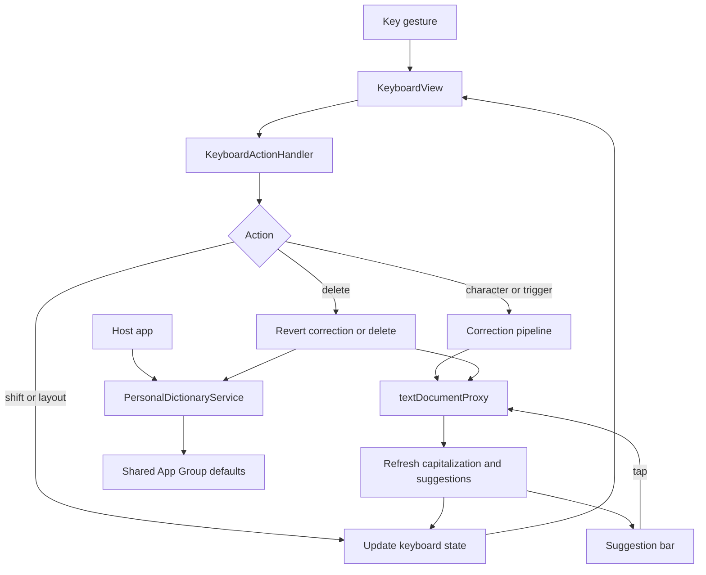

# MyCuKey ⌨️

A custom iOS keyboard extension built with SwiftUI and UIKit. The focus is practical typing reliability: predictable correction, fast feedback, and a clear line between what the keyboard fixes silently and what it only suggests. Priorities and platform ceilings are tracked in [docs/ReliabilityRoadmap.md](docs/ReliabilityRoadmap.md).

---

## 🛠️ Tech Stack

* **Language:** Swift 6
* **UI:** SwiftUI and UIKit
* **Platform:** iOS 18.0+
* **Architecture:** MV app plus a responsibility-grouped keyboard extension with shared App Group storage
* **Correction:** noisy-channel `WordTrie` decoder over a ~42k-word frequency lexicon, adjacency-weighted edit costs, bigram context, `UITextChecker` bridge

---

## 📐 Scope

- **Typing language today:** English-first keyboard behavior
- **App localization:** English and German
- **Keyboard layout today:** one keyboard layout system shared across alphabetic, numeric, and symbolic modes

MyCuKey currently treats English as the main typing language for autocorrection, suggestions, and dictionary heuristics. German support currently applies to the companion app UI, not to a separate German keyboard layout or German correction engine.

---

## 🚀 Setup

1. Open `MyCuKey.xcodeproj` in Xcode.
2. Ensure both targets have the **App Group** capability with `group.com.kvolodymyr.MyCuKey`.
3. Add your Apple account in Xcode Signing if needed.
4. Build and run the **MyCuKey** app scheme.
5. On device or simulator: **Settings → General → Keyboard → Keyboards → Add New Keyboard → MyCuKey**
6. Toggle **Allow Full Access** on the keyboard entry.
7. Switch to MyCuKey via the globe key in any text field.

Deterministic CLI build and test, plus the `swift-format` pre-commit hook:

```bash
scripts/xc.sh build                  # build for the pinned simulator
scripts/xc.sh test                   # run the unit and snapshot suite
scripts/xc.sh format                 # format all sources in place
git config core.hooksPath .githooks  # auto-format staged Swift on commit
```

---

## ✨ Features

- **QWERTY / Numeric / Symbolic** layout switching with sentence-aware auto-capitalization
- **Autocorrection** — conservative trust-first fixes, wrapped plain words (`*teh* → *the*`), and immediate revert on the next backspace
- **Unified decoder** — one `WordTrie` over the ~42k lexicon answers prefix completion and bounded Damerau-Levenshtein repair at every token length; protect-in-vocab leaves valid words alone
- **Spatial decoder** (in progress) — per-tap `(x,y)` capture and a Gaussian key model feed a beam search over sloppy taps; wired, pending on-device tuning
- **Suggestion bar** — original token, strongest repair, and a secondary alternative
- **Correction triggers** — pass runs on `space` `.` `,` `!` `?` `*` and newline; double-space inserts `. `
- **Caps Lock** (double-tap shift), **key popups** with long-press alternates, and **spacebar trackpad** cursor drag with 3-zone acceleration
- **Accelerated delete** — character-by-character for ~1s, then word-by-word
- **Haptics** — distinct feedback per action, silent on empty field
- **Personal dictionary** — learns reverted corrections and suppresses future passes (see rules below)
- **Dark/Light mode** — follows system appearance

---

## 🏗️ Architecture

MyCuKey follows the standard hybrid custom-keyboard structure used by many serious iOS keyboard projects:

- **Keyboard extension** — real-time typing UI, key handling, correction, suggestion, and cursor behavior
- **Companion app** — setup flow, learned-word management, and app-side UI
- **Shared App Group storage** — shared learned-word state and settings between app and extension

This keeps latency-sensitive behavior local to the extension while still allowing the main app to manage longer-lived state.

The keyboard extension is grouped by responsibility: `Input/` (key handling and the suggestion-bar flow), `Decoding/` (`WordTrie`, the unified noisy-channel `UnifiedDecoder`, and the `SpatialDecoder` tap decoder), `Autocorrection/` (the engine plus its ranking and gating pipeline), `Suggestions/` (candidate providers and the trie-backed `SuggestionCandidateIndex`), `Lexicon/` (frequency and personal-dictionary sources), and `Views/`, `Styles/`, `Utilities/`, `Resources/` for the UI layer.

---

## 🗺️ Typing Engine Roadmap

Target: Apple-grade "type sloppily, get the right words" on English. Three levers, in priority order:

1. **Decoder auto-apply** *(shipped)* — the noisy-channel decoder silently commits a repair, but only when it is alone in its adjacency-weighted cost cluster and the token is neither a real word (checked via `UITextChecker`) nor an intentional spelling. Fixes `peoole → people`, `dobe → done`; defers ambiguous cases to #2.
2. **Bigram context** *(shipped)* — `BigramModel` breaks edit-distance ties by the previous word (`fifty fivd → five`) and rescues short tokens when it is decisive (`spent ny → my`). The context path also folds in `UITextChecker` guesses to reach inflections the lexicon omits (`i slent → spent`), committing them only when context backs them.
3. **Word split / merge** *(not started)* — retokenize across spaces for `firme → for me`, `ibt he → in the`. Hardest, smallest payoff.

---

## 🧱 Platform Ceilings

Limits of the public iOS custom-keyboard API, not local bugs:

- **Host presentation** — a brief flash or jump on keyboard appear/switch; the system host is not fully controllable.
- **Background coverage** — the keyboard owns its content area but not the full system-managed space around it.
- **Cursor/navigation** — character-by-character movement is reliable, but multiline cursor and selection depend on limited `UITextDocumentProxy` context after the insertion point.
- **Document model** — no rich editable text model, selection-mutation APIs, or Apple's private autocorrection stack.

---

## 🧪 Testing

Three layers, all runnable headless via `scripts/xc.sh`:

- **Unit** (`test`) — correction, dictionary, and capitalization logic
- **Snapshot** (`test`) — in-process SwiftUI view rendering pinned against committed references
- **End-to-end** (`uitest`) — XCUITest typing on the **live** keyboard extension and asserting autocorrection fires

---

## 📖 Personal Dictionary Rules

Protects typing trust: names, slang, and intentional spellings stop being "fixed" once the user shows the keyboard was wrong.

- Storage: shared App Group `UserDefaults` (`group.com.kvolodymyr.MyCuKey`), refreshed by app and extension
- Token rules: lowercased, length `2...40`, at least one letter, letters/digits/apostrophe/hyphen
- Promotion: a correction reverted twice learns the original word; manual edits clear its revert count

---

## 🔁 Request Flow

High-altitude view of the main keyboard loop.


```mermaid
flowchart TD
    U[Key gesture] --> V[KeyboardView]
    V --> H[KeyboardActionHandler]

    H --> D{Action}
    D -->|shift or layout| T[Update keyboard state]
    D -->|delete| R[Revert correction or delete]
    D -->|character or trigger| C[Correction pipeline]

    C --> P[textDocumentProxy]
    R --> P
    P --> S[Refresh capitalization and suggestions]
    S --> BAR[Suggestion bar]
    BAR -->|tap| P
    S --> T
    T --> V

    APP[Host app] --> PD[PersonalDictionaryService]
    R --> PD
    PD --> G[Shared App Group defaults]
```

On a character or trigger key the correction pipeline runs in order, first match wins:

1. Pending suggestion follow-up (punctuation after a committed suggestion, double-space → period)
2. Standalone lowercase `i` → `I`
3. Learned-word suppression (personal dictionary blocks the rest)
4. Contraction repair (`dont` → `don't`)
5. Autocorrection engine — curated pairs, then UITextChecker typos, then the adjacency-weighted decoder (commits only when the repair is alone in its cost cluster; bigram context breaks ties)
6. Plain insert
